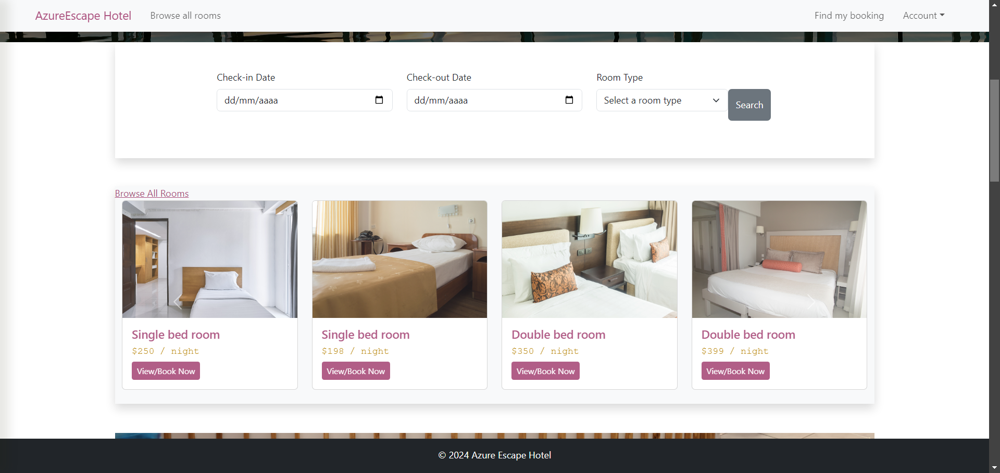

# Projeto Azure Escape Hotel

## Sobre o Projeto
O AzureEscapeHotel é uma plataforma abrangente para a administração de hotéis, integrando as tecnologias React, Bootstrap, Redis, MySQL e Spring Boot. A solução oferece interfaces responsivas e personalizadas que permitem o gerenciamento eficiente de quartos e tarifas, atendendo tanto às necessidades dos administradores quanto dos usuários comuns.A segurança foi uma prioridade, com a implementação de autenticação e autorização por meio de JWT, além da criptografia de dados sensíveis para proteger as informações dos usuários. O desempenho da aplicação foi significativamente aprimorado através do uso de Redis para caching, o que reduziu o tempo de resposta em até 50%. Além disso, técnicas de otimização e compressão de imagens foram aplicadas, diminuindo o tempo de carregamento das páginas.
## Imagens do Projeto




## Funcionalidades
- Gestão de Quartos: Cadastro, atualização e exclusão de quartos com interface intuitiva.
- Gestão de Clientes: Registro de novos clientes, com armazenamento seguro de dados pessoais.
- Sistema de Reservas: Criação, modificação e cancelamento de reservas com verificação em tempo real da disponibilidade dos quartos.
- Visualização de Disponibilidade: Exibição clara e filtrável dos quartos disponíveis, incluindo opções de pesquisa por datas e tipos de acomodação.
- Autenticação e Autorização: Implementação de segurança robusta utilizando JWT para garantir que somente usuários autenticados possam acessar funções específicas.
- Dashboard Administrativo: Painel de controle para administradores com visualização de estatísticas em tempo real, incluindo ocupação de quartos, histórico de reservas e insights sobre desempenho.
- Caching com Redis: Redução do tempo de resposta em até 50% com a utilização de Redis para cache de dados frequentemente acessados.
- Otimização de Imagens: Compressão e otimização de imagens para acelerar o carregamento das páginas, proporcionando uma experiência de usuário mais ágil.
- Segurança de Dados: Criptografia de informações sensíveis para proteção dos dados dos usuários e conformidade com as melhores práticas de segurança.
 -Responsividade: Interfaces totalmente adaptáveis para dispositivos móveis, tablets e desktops, garantindo uma experiência de usuário consistente em todas as plataformas.


## Tecnologias Utilizadas
- React: Biblioteca JavaScript para a criação de interfaces de usuário interativas.
- Bootstrap: Framework front-end para o desenvolvimento de sites responsivos e estilizados.
- Redis: Banco de dados em memória para caching de dados e otimização de desempenho.
- MySQL: Sistema de gerenciamento de banco de dados relacional para armazenamento seguro de informações.
- Spring Boot: Framework Java para o desenvolvimento de aplicações web robustas e escaláveis.
- JWT: JSON Web Tokens para autenticação e autorização seguras.
- Criptografia: Algoritmos de criptografia como BCrypt para proteção de dados sensíveis.
- Swagger: Ferramenta para documentação de APIs RESTful.

##Como Executar o Projeto
1. Clone o repositório para sua máquina local.
   
### 1. Executando o Backend (Spring Boot)

1. **Navegue para o diretório do backend**:
   ```bash
   cd /caminho/para/o/diretorio/que/contem/o/pom.xml
   ```
1. 1. **Instale as dependências:**:
    ```bash
    mvn clean install
    ```
1. 2. **Execute o aplicativo Spring Boot**:
    ```bash
    mvn spring-boot:run
    ```
1. 3. **O backend estará disponível em**:
    ```
    http://localhost:9192
    ```
1. 4. **Acesse a documentação da API no Swagger em**:
    ```
    http://localhost:9192/swagger-ui.html
    ```
1. 5. **As credenciais de login padrão são**:
    ```
    Usuário: admin
    Senha: password
    ```
   
### 2. Executando o Frontend (React/Vite)
2.  1. **Navegue para o diretório do frontend**:
   ```bash
   cd /caminho/para/o/diretorio/que/contem/o/package.json
   ```
2.  2. **Instale as dependências**:
    ```bash
    npm install
    ```
2.  3. **Execute o aplicativo React/Vite**:
    ```bash
    npm run dev
    ```
2.  4. **O frontend estará disponível em**:
    ```
    http://localhost:5173
    ```


